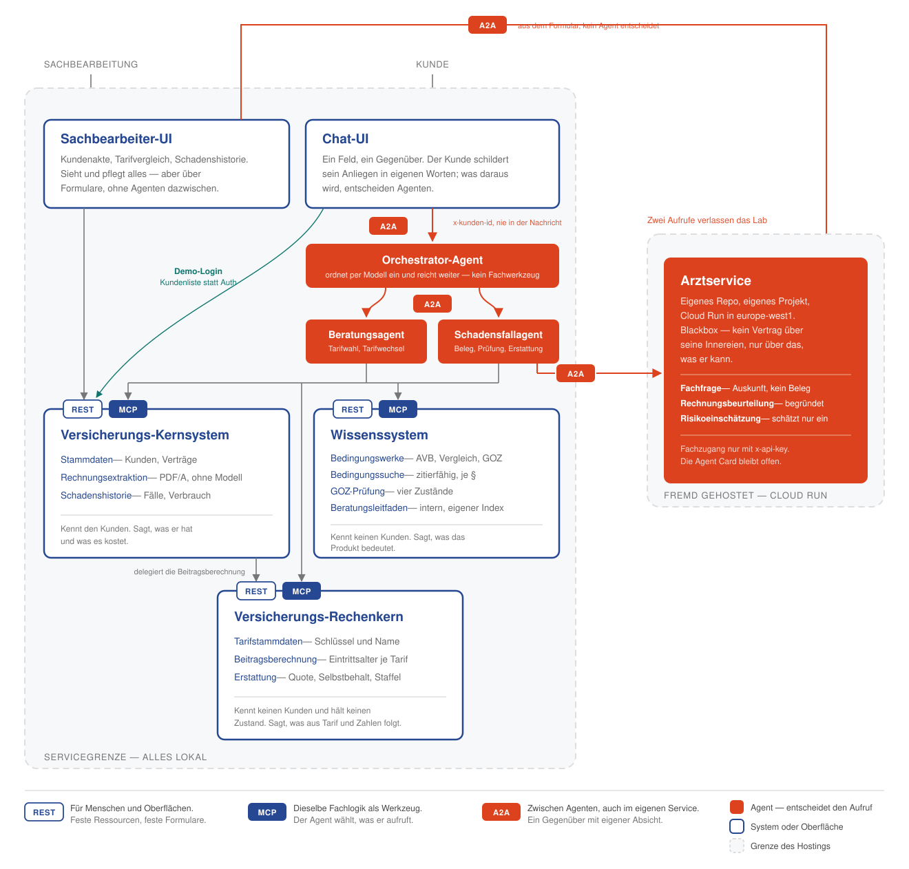

<p align="center">
  
</p>

<h1 align="center">MCP &amp; A2A Lab</h1>

<p align="center">
  <em>A practice setup from <a href="https://atra.consulting/">atra.consulting</a>:<br>
  the same domain logic once as a REST interface, once as an MCP tool<br>
  and once as a standalone agent behind A2A.</em>
</p>

<p align="center">
  
  
  
  
  
</p>

---

## What this is about

Agents need different interfaces than forms do. With REST it is settled up front
which endpoint comes next — whoever built the screen decided that. With MCP a
model decides it at runtime, and all it gets to see is the description of the
Tool. With A2A there is no tool at the other end at all, but a counterpart with
an intent of its own.

This lab puts the three approaches side by side, on the same domain logic, so
that the difference shows in the protocol rather than in the domain. And it
shows what happens when an agent brings them together: the boundaries each
system draws for itself end at its interface. The domain itself is an invented
dental supplementary insurance, and deliberately dull — every rule can be looked
up in the Bedingungswerke, nobody has to know anything about insurance.

## Architecture



Outlined in blue are systems and user interfaces; filled orange are the agents.
The dashed frame is the service boundary — everything inside it belongs together
and runs locally. Only the Arztservice sits outside: its own repository, its own
GCP project, Cloud Run. All the lab knows of it is a URL and a key.

Two calls cross that boundary: the Schadensfallagent, when it needs an expert
opinion on the Positionen of a Rechnung, and the Sachbearbeiter-UI, which
fetches the same opinion straight from a form — with no agent in between to act
on it.

**It is addressed over A2A, but not for that reason.** The reason is that it is
an agent itself: it asks back when something is missing instead of guessing, and
MCP presupposes a counterpart with no intent of its own. The Beratungsagent sits
*inside* the service boundary and speaks A2A for the same reason. Conflate
hosting with the choice of protocol and sooner or later you rebuild an agent as
a tool; the two axes are pulled apart in [architecture.md](architecture.md).

What each building block does, why it is cut the way it is, and how the two
flows (Tarifwechsel and Schadensfall) run end to end:
**[architecture.md](architecture.md)**

## Prerequisites

| Tool | Version | What for |
|---|---|---|
| **Java** | 25 (LTS) | the six Spring Boot applications — e.g. [Temurin](https://adoptium.net) |
| **Maven** | 3.9+ | builds and starts them |
| **Node.js** | 20.19+ or 22.12+ | the two SvelteKit user interfaces |
| **Typst** | current | only to rebuild Bedingungswerke, Rechnungen and health declarations — the finished documents ship under `wissen/generated/` and `submissions/` in the repository |
| **Python** | 3 | only for the form of the Rechnung generator |

`./start.sh` checks only what it also starts — without Node the Java services
run anyway. `./setup.sh` checks every tool at once and pre-installs the
dependencies of every subproject; whatever is missing it reports together at the
end.

## Quickstart

```bash
git clone https://github.com/atra-consulting/atra-mcp-a2a-lab.git
cd atra-mcp-a2a-lab
cp .env.beispiel .env        # enter the Gemini key
./setup.sh                   # optional: check and pre-install everything
./start.sh
```

**Three services need the Gemini key** and will not start without it:
Orchestrator, Beratungsagent and Schadensfallagent. In all three, every incoming
message goes through a model call — in the Schadensfallagent even every case its
poller fetches for itself. The key lives in `.env` in the root directory — the
same file is read by `./start.sh` and, for the Wissensdienst as the only
building block left with a Dockerfile, by `docker run --env-file .env`. It is
not versioned; `.env.beispiel` next to it shows what belongs in it. The
remaining building blocks run without a key: `./start.sh wissen
sachbearbeiter-ui` starts them on their own.

**The Schadensfall additionally needs a network, and that is new.** Since 21
August 2026 the Arztservice has run on Cloud Run under someone else's roof
([atra-arzt-service](https://github.com/atra-consulting/atra-arzt-service)) and
demands a key of its own. Its **address** is not a variable but a line in the
`agenten.subagents.catalog` of every agent that should know it — its address and
its key in the same three lines, and deleting the entry is the whole removal.
The two **values** live in `.env`, because a secret does not belong in a
versioned file:

```bash
AGENTEN_ARZTSERVICE_URL=…          # its address on Cloud Run
AGENTEN_ARZTSERVICE_API_KEY=…      # ask the operator for it
```

A key stands on one entry and reaches one agent. Another agent in the same
catalog gets nothing, even if its own card asks for a key.

Which header the key belongs in is not configured anywhere: it is read out of
the foreign agent's own Agent Card (`securitySchemes`).

Without a connection, or without that key, the lab keeps running, but every case
check ends with the Eskalationsgrund `ARZT_UNAVAILABLE` — handed back to a
human, never a quiet Freigabe. That is the right reaction and still a
limitation: **Journey 3 can no longer be demonstrated offline.** Beratung and
Tarifwechsel still can.

On the first run the script installs the npm dependencies and downloads the
embedding model of the Wissensdienst (around 490 MB, once). Nothing is built:
Bedingungswerke and search indexes ship ready under `wissen/generated/` in the
repository — change a source under `wissen/` and rebuild with
`./wissen/build.sh`. After that:

| Address | What is there |
|---|---|
| <http://localhost:5173> | Sachbearbeiter-UI — Kundenakte, Tarifvergleich |
| <http://localhost:5174> | Kunden-Chat |
| <http://localhost:8080/api/v1> | Kernsystem, REST |
| <http://localhost:8080/mcp> | Kernsystem, MCP |
| <http://localhost:8086/api/v1> | Rechenkern, REST |
| <http://localhost:8086/mcp> | Rechenkern, MCP |
| <http://localhost:8082/api/v1> | Wissensdienst, REST |
| <http://localhost:8082/mcp> | Wissensdienst, MCP |
| <http://localhost:8084/.well-known/agent-card.json> | Orchestrator, Agent Card |
| <http://localhost:8084/> | Orchestrator, JSON-RPC (POST, method `message/send`) |
| <http://localhost:8085/.well-known/agent-card.json> | Beratungsagent, Agent Card |
| <http://localhost:8085/> | Beratungsagent, JSON-RPC (POST, method `message/send`) |
| <http://localhost:8087/.well-known/agent-card.json> | Schadensfallagent, Agent Card |
| <http://localhost:8087/> | Schadensfallagent, JSON-RPC (POST, method `message/send`) |

Not in this list: the Arztservice. It has no port in the lab but an address —
`https://atra-arzt-service-lqryukukoa-ew.a.run.app`. Its Agent Card is open
there under `/.well-known/agent-card.json`; the domain endpoints beneath it
require the header `x-api-key`.

Port 8080 belongs to the Kernsystem, exactly as the `servers` entry of
`oas/openapi.yaml` says. The form of the Rechnung generator
(`python3 generator/rechnungen/frontend.py`, not started by `./start.sh`) wants
the same port and cannot be moved — if you need both at once, push the
Kernsystem out of the way. That is why 8083 stays free, as its fallback port.
Every port can be overridden through the environment, from `KERNSYSTEM_PORT` to
`KUNDEN_CHAT_PORT` — the full list is in `start.sh`:

```bash
KERNSYSTEM_PORT=8083 ./start.sh
WISSEN_PORT=9000 ./start.sh wissen
```

The three MCP servers differ in one point beyond their address: Wissensdienst
and Rechenkern know not a single customer, the Kernsystem knows them all — and
the Kundennummer travels in the header `x-kunden-id`, not in the arguments of a
Tool.

Starting individual building blocks:

```bash
./start.sh wissen kernsystem      # only the two services
./start.sh kunden-chat            # only one user interface
./start.sh --hilfe
```

Ctrl+C stops everything the script started.

### When Ctrl+C was not enough

`./stop.sh` clears the lab out. For the times when the terminal is gone, a
service hung on to its port, or a run was killed hard enough that `start.sh`
never got to its own cleanup:

```bash
./stop.sh                        # everything
./stop.sh wissen kernsystem      # only the ones named
./stop.sh --hilfe
```

It works in three steps, each of which is allowed to find nothing. A `start.sh`
that is still running gets a TERM first, because its own trap is the tidiest way
to take its children down. Whatever still sits on one of the lab's sixteen ports
— eight services, eight debug ports — gets a TERM and, if it survives that, a
KILL. Anything left over with no port any more, a `mvn` that lost its service or
a Vite that stopped answering, is found by its working directory and stopped
too.

That last part is the reason `stop.sh` never reaches outside this repository: a
process is only a candidate if its working directory lies under the repository
root, so a Maven or a Node from another project is not touched. Steps one and
three run only when no building block was named — `./stop.sh kunden-chat` means
the rest of the lab is meant to keep running. `stop.sh` and `start.sh` read
their ports from the same `components.sh` and the same `.env`, so a port moved
in `.env` is a port `stop.sh` knows about.

### An agent that starts on its own

The Schadensfallagent is the only building block that gets going unprompted: a
poller looks every ten seconds for cases in status `eingereicht` and takes each
one over by compare-and-set. Submit a Rechnung in the Kunden-Chat and the
Bewertung therefore shows up in the Sachbearbeiter-UI under `/faelle/[id]`
without anyone having clicked anywhere. **On a fresh stack that takes roughly a
minute:** the poller works in order and one case at a time, and the Bestand
ships with exactly one case already in `eingereicht` (50014) — at roughly 35
seconds per check, and since that seed case is ahead of yours in the queue,
your own Rechnung comes up after about 70 seconds. Note that
resetting the Bestand (`./start.sh --bestand-zuruecksetzen`) restores that same
seed case rather than removing it, so it does not shorten the wait. If you
would rather not wait even that, switch the clock off altogether. For a demo
in which nothing is meant to happen by itself:

```bash
SCHADENSFALL_POLL_ENABLED=false ./start.sh
```

It then checks only on request — through its A2A skill `fall_pruefen`, which is
also what sits behind the „Erneut prüfen lassen" button of the
Sachbearbeiter-UI. That button is on `/faelle/[id]` even for a freshly submitted
case, so in this mode it is the way from Einreichung to Bewertung without Bruno.
The whole chain, from submitting to the Bewertung, can be walked by hand with
the Bruno folder `08 - Schadensfallagent`.

### Attaching a debugger

`--debug` opens a debug port next to every building block it starts and leaves
it open. The six JVMs get a JDWP agent, the two user interfaces run under the
Node inspector. Nothing waits for anybody: the script owns the processes, the
IDE owns the connections, and it attaches and detaches without the lab
restarting.

```bash
./start.sh --debug                  # all building blocks, all ports
./start.sh --debug kernsystem       # only this one
```

The debug port is the building block's port plus 1000:

| Building block | Port | Debug | Protocol |
|---|---|---|---|
| `kernsystem` | 8080 | 9080 | JDWP |
| `wissen` | 8082 | 9082 | JDWP |
| `agenten-orchestrator` | 8084 | 9084 | JDWP |
| `agenten-beratung` | 8085 | 9085 | JDWP |
| `rechenkern` | 8086 | 9086 | JDWP |
| `agenten-schadensfall` | 8087 | 9087 | JDWP |
| `sachbearbeiter-ui` | 5173 | 6173 | Node inspector |
| `kunden-chat` | 5174 | 6174 | Node inspector |

Each one can be overridden on its own (`KERNSYSTEM_DEBUG_PORT`, …), and
`DEBUG_HOST` sets the address. The default is `127.0.0.1` rather than `*`: an
open JDWP port is code execution for anyone on the same network, and a workshop
sits on the same wifi.

Both protocols are open ones, so no IDE is privileged here — the script only
opens ports, and each IDE attaches with its own built-in configuration. The
ready-made ones ship with the repository:

| | IntelliJ | VS Code |
|---|---|---|
| Start the lab | Run configuration `start.sh --debug` | Task `start.sh --debug` |
| Attach to everything | `Debug: Alle` | Compound `Debug: Alle` |
| Attach to one | `Debug: Kernsystem`, … | `Debug: Kernsystem`, … |

They live in `.idea/runConfigurations/` and `.vscode/launch.json` — the two
directories that are otherwise ignored, with these files carved out. `Debug:
Dienste` and `Debug: Agenten` attach to the three services and the three agents
respectively.

The agent replaces a module's JVM arguments rather than joining them, and the
Wissensdienst is the one module that has any: `--enable-native-access`, for the
native library behind its tokenizer. Attached to a debugger it runs without that
flag and prints three warnings about restricted methods. Nothing breaks by it,
and outside `--debug` the flag is there as always.

Where it would break is a `<jvmArguments>` inside a plugin `<configuration>`:
Maven gives that precedence over `-Dspring-boot.run.jvmArguments`, so the agent
would go missing while the service started up perfectly — a debug port that is
simply absent, with nothing in any log to say why. JVM arguments therefore
belong in `<properties>`, as the default of that same property, which is how
`wissen/dienst/pom.xml` sets its flag.

Two things the ports do not reach. The Node inspector sees only the server half
of the user interfaces — `+page.server.ts`, `+server.ts`, `hooks.server.ts` and
the loads during SSR; what runs in the browser needs the browser's own debugger.
And sitting on a breakpoint for longer than `SCHADENSFALL_RECONCILE_TIMEOUT`
(20 minutes) has the case taken back out from under you, so for a session at a
breakpoint switch the clock off:

```bash
SCHADENSFALL_POLL_ENABLED=false ./start.sh --debug agenten-schadensfall
```

### Tracelog of the agent traffic

When an agent has done something other than what was expected, the trace in the
browser is often not enough: it is made for a human and gone with the window.
`--tracelog` writes the same traffic to disk as well — complete,
machine-readable and across all services:

```bash
./start.sh --tracelog
```

It holds one line of JSON per event: every A2A hop, every MCP call with its raw
result, every decision in the model, plus the Anliegen and the answer from the
chat surface. Every line carries a timestamp and a `context`; every service
writes into its own file under `tracelog/`.

```bash
# everything in chronological order
cat tracelog/*.jsonl | jq -s 'sort_by(.timestamp)[]'

# a single context
cat tracelog/*.jsonl | jq -s 'map(select(.context=="<id>")) | sort_by(.timestamp)[]'

# only the MCP calls of the Beratungsagent
jq 'select(.protocol=="MCP")' tracelog/beratung.jsonl
```

The flag applies to the whole run and cannot be added later: a tracelog that
starts in the middle of a run has a hole in exactly the place you are looking.
The directory can be redirected: `AGENTEN_TRACELOG=/tmp/lauf7 ./start.sh`.

> The tracelog contains plain text from the dialogue, Kundennummer included, and
> the raw results of the tools. `tracelog/` is therefore not versioned.

## Building blocks

| Directory | What is in it | More on it |
|---|---|---|
| `kernsystem/` | Kernsystem: Kunden with their Vertrag, claim history, Rechnung extraction. Spring Boot, REST **and** MCP with a hard Mandantengrenze through `x-kunden-id`. One tool delegates to the Rechenkern | [kernsystem/README.md](kernsystem/README.md) |
| `rechenkern/` | Rechenkern: tariff master data, Beitragsberechnung, Erstattungsberechnung. Spring Boot, REST **and** MCP, stateless, no Mandant, no API key | |
| `wissen/` | Wissensdienst: semantic search in the Bedingungswerke, GOZ-Pruefung, Beratung material. Spring Boot, REST **and** MCP | [wissen/README.md](wissen/README.md) |
| `produktmodell/` | The one Java parser of the product model in `wissen/daten/tarife.yaml`. Used by the Wissensdienst and by the Rechenkern, there for the Erstattungsberechnung | |
| `agenten/` | Orchestrator, Beratungsagent and Schadensfallagent. A2A among themselves, MCP to Kernsystem, Rechenkern and Wissensdienst. Six Maven modules: protocol frame, ModelClient, MCP client side, three services | [agenten/README.md](agenten/README.md) |
| `sachbearbeiter-ui/` | The internal backoffice as a SvelteKit app. Forms onto fixed endpoints, no agent in between — the reference point in the lab | [sachbearbeiter-ui/README.md](sachbearbeiter-ui/README.md) |
| `kunden-chat/` | Chat surface for customers, talks only to the Orchestrator | [kunden-chat/README.md](kunden-chat/README.md) |
| `oas/` | The binding contracts: `openapi.yaml` (Kernsystem), `rechenkern.yaml` (Rechenkern), `wissen.yaml` (Wissensdienst) | |
| `bruno/` | Bruno collection against the running services: one request per operation, plus errors, MCP and the whole chain through the Schadensfallagent. Carries assertions, so `bru run` works as a smoke test | |
| `docs/` | Journeys, glossary, conventions | [docs/user-journeys.md](docs/user-journeys.md) |
| `assets/` | Logo, architecture picture and the corporate design the Typst documents read their colours and fonts from | |
| `tools/` | Development tooling that is not part of the running lab: the jdtls-driven rename harness behind the language rule | [tools/rename/README.md](tools/rename/README.md) |

**One building block is missing from this table, and that is the point:** the
Arztservice no longer has a directory here. It lives in
[atra-arzt-service](https://github.com/atra-consulting/atra-arzt-service), runs
on Cloud Run and promises four skills through its Agent Card —
`fachfrage-beantworten`, `rechnung-beurteilen`, `risikoeinschaetzung` and
`termin-vereinbaren`. What the lab has of it is a URL, a key and that card; what
drives it, the lab does not see. It is addressed by the Orchestrator and by the
Schadensfallagent (Tool `arzt_befragen`) — and both reach it only because its
address stands in their `agenten.subagents.catalog`, not because either of them
knows its name.

### Material, and the machinery for it

Two more directories sit in the root, and neither of them is a building block.
**`./start.sh` starts neither**, and nothing is built in either. One crossing
exists on purpose: the Kernsystem's extraction tests read the checked-in PDFs
and case files under `submissions/rechnungen/` as their ground truth, so
`mvn -f kernsystem/pom.xml test` fails without that directory. Nothing reaches
into `generator/` at all.

| Directory | What is in it | More on it |
|---|---|---|
| `submissions/` | What arrives at atra: 18 dental Rechnungen and 15 health declarations as PDF/A, each beside the case file that is the ground truth for it. The PDFs are checked in, so **no Typst is needed** — these are the documents to upload into the Kunden-Chat | [submissions/README.md](submissions/README.md) |
| `generator/` | The Typst machinery that produced them: five invented practices in five layouts, `reconcile.sh` for keeping the checked-in PDFs honest, and a local form for writing a new Rechnung. Needs Typst; nobody needs it in order to use the material | [generator/README.md](generator/README.md) |

Until August 2026 the two were one directory each, and nothing in the layout
said which half a newcomer had to care about. Splitting them says it: the
generator writes into `submissions/`, everything else reads out of it, and the
arrow never points the other way.

## Structure

The tables above name what sits in the root. Only two building blocks are
divided up inside:

```
wissen/                   Wissensdienst
├── daten/                product model and GOZ mapping as YAML
├── dokumente/            Bedingungswerke as Typst sources
└── dienst/               Java sources

agenten/                  six Maven modules, plus the Agent Cards
├── a2a/                  protocol frame: A2A 0.3 (SDK generation), server adapter with SSE, client
├── model/                access to the language model
├── mcp/                  the MCP client side
├── orchestrator/         classifies and passes on
├── beratung/             conducts the Beratung
├── schadensfall/         checks submitted cases -- poller and A2A
└── cards/                the three Agent Cards
```

Also in the root: `setup.sh` checks the tools and installs every dependency,
`start.sh` starts the lab, `stop.sh` clears it out again when Ctrl+C did not get
the chance, `components.sh` holds the one list of building blocks and their
ports that both scripts read, `architecture.md` describes the cut of the
systems, `AGENTS.md` collects the project knowledge for AI assistants.

### The two IDE directories

`.idea/` and `.vscode/` are ignored, with one carve-out each: the run
configurations are versioned, everything else in them is not.

```gitignore
.idea/*
!.idea/runConfigurations/
.vscode/*
!.vscode/launch.json
!.vscode/tasks.json
```

The line between the two halves is whether a file says something about the lab
or something about one machine. `workspace.xml` remembers which tabs were open
and where the windows sat — that is state of one installation and belongs to
nobody else. A run configuration that attaches to port 9080 is a fact about the
lab, the same for everyone, and typing it into a dialog by hand is exactly the
kind of setup a workshop should not spend its first half hour on.

What is versioned, then:

| File | What it is |
|---|---|
| `.idea/runConfigurations/Kernsystem.xml` | starts the Kernsystem with the right working directory — see [kernsystem/README.md](kernsystem/README.md#starting) |
| `.idea/runConfigurations/{setup,start,stop}_sh*.xml` | the three scripts, `start.sh` once plain and once with `--debug` |
| `.idea/runConfigurations/Debug__*.xml` | eight attach configurations plus the compounds `Alle`, `Dienste`, `Agenten` |
| `.vscode/launch.json` | the same eight attach configurations and the same three compounds |
| `.vscode/tasks.json` | the same four entries as tasks — `setup.sh`, `start.sh`, `start.sh --debug`, `stop.sh` |

Adding another one means adding it to this carve-out as well — a new file
directly under `.idea/` stays ignored, and `git add` will not take it without
`-f`. That is deliberate: the carve-out is a whitelist, not a starting point.

## Conventions

Identifiers are English throughout. German is reserved for the terms in the
domain glossary and for the interface descriptions a language model reads, and
where German stays it is written without umlauts (`ae`, `oe`, `ue`). The
language rule, the MCP input types and the agent cards in detail:
[docs/code-conventions.md](docs/code-conventions.md).

---

> **All invented.** Tarife, Leistungen, limits, Beitraege, practices and
> Rechnungen are made up entirely. There is no connection to real products,
> providers or people.
