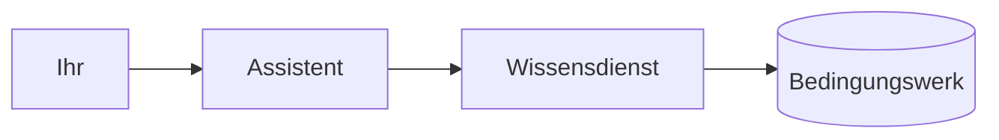

# 03 — Den Wissensdienst an euren Assistenten hängen

**Dauer:** 20 min
**Werkzeug:** Claude Code
**Voraussetzung:** Lab läuft, Aufgabe 02 abgeschlossen
**Ziel:** Euer Coding-Assistent kann Versicherungsbedingungen lesen, ohne dass ihr sie ihm gebt.
**Ergebnis:** Eine Konfigurationsdatei, die den Wissensdienst als MCP-Server einbindet, und eine beantwortete Fachfrage.

Bis hierher habt ihr den Server von Hand bedient. Jetzt bekommt ihn das Modell —
derselbe Assistent, mit dem ihr seit gestern arbeitet, bekommt Zugriff auf eine
Fachdomäne, von der er nichts weiß.

## Schritte

1. Legt die MCP-Konfiguration für euren Assistenten an und tragt den
   Wissensdienst als Server mit Streamable HTTP ein.
2. Startet den Assistenten neu und lasst euch die verfügbaren Werkzeuge
   auflisten.
3. Stellt eine Fachfrage, die nur mit dem Bedingungswerk zu beantworten ist.
4. Fragt anschließend nach der Quelle: Aus welchem Abschnitt stammt die Antwort?
5. Stellt dieselbe Frage in einer neuen Sitzung **ohne** den Server und
   vergleicht.

## Prompt

**1 — Die Konfiguration.** Für Claude Code als `.mcp.json` im Projektordner:

```json
{
  "mcpServers": {
    "atra-dent-wissen": {
      "type": "http",
      "url": "http://localhost:8082/mcp"
    }
  }
}
```

**2 — Die Fachfrage.** Sie ist so gewählt, dass allgemeines Wissen nicht reicht:

```
Ab wann zahlt atra.dent bei Zahnersatz, und welche Wartezeit gilt im Tarif
Komfort? Nenne die Fundstelle.
```

**3 — Die Gegenprobe.** Dieselbe Frage, neue Sitzung, kein Server verbunden.
Notiert, was der Assistent stattdessen tut.

## Troubleshooting

- **Der Assistent sieht keine Werkzeuge.** Die Konfiguration wird beim Start
  gelesen — ein laufender Assistent zieht sie nicht nach.
- **Der Assistent fragt nach Erlaubnis.** Das ist richtig so und gehört zum
  Thema: Ein Werkzeugaufruf ist Codeausführung, und der Host fragt.

## Diskussion

Zeichnet den Weg der Fachfrage auf, bevor ihr redet — als Mermaid-`flowchart`,
sechs Zeilen, im Repository neben dem Code:



An der Skizze lässt sich die Frage stellen, statt sie zu behaupten: Wo genau
steht die Werkzeugbeschreibung, und was davon liegt in jedem Aufruf im Kontext?

Der Assistent hat jetzt fünf zusätzliche Werkzeuge. Im einfachen Fall — und so
arbeitet der Host in diesem Lab — stehen ihre Beschreibungen ab sofort in jedem
Aufruf im Kontext, auch wenn ihr über etwas ganz anderes redet. Bei fünf
Werkzeugen fällt das nicht auf. Bei fünfzig?

Dass es so bleiben muss, gilt nicht mehr: Neuere Hosts laden Werkzeugdefinitionen
erst bei Bedarf nach oder lassen das Modell in ihnen suchen, statt alle
mitzuschicken. Prüft es an eurem eigenen Werkzeug nach, statt es zu glauben —
die Zahl steht im Verbrauch, den ihr gleich vergleicht.
